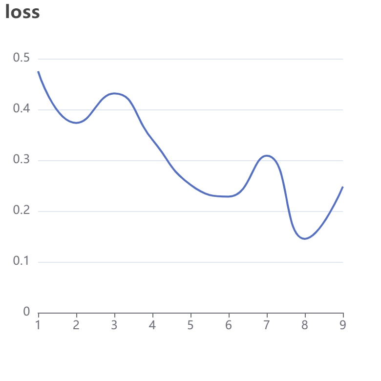
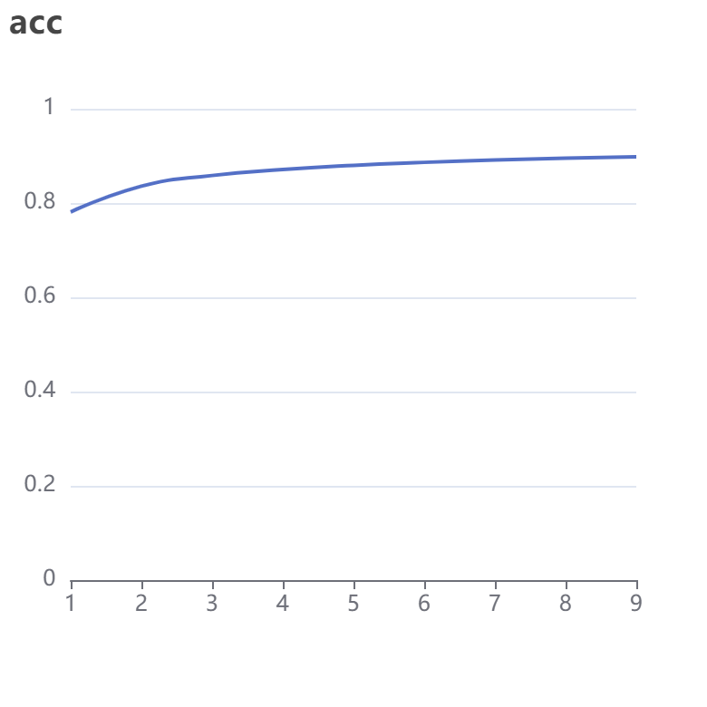

### 实验任务

使用公开数据集完成深度学习模型的开发、训练和预测。

### 数据集

minist

### 深度学习模型

pytorch

### 实验环境

nki

### 实验结果及分析、

训练任务id:26597 开始进行数据集下载

数据集下载结束,启动onMessage()进行训练

本次训练使用的GPU个数：1

Sequential( 

(0): ReLU()

 (1): Conv2d(1, 1, kernel_size=(3, 3), stride=(1, 1)) 

(2): MaxPool2d(kernel_size=3, stride=1, padding=0, dilation=1, ceil_mode=False) 

(3): ReLU() 

(4): Conv2d(1, 1, kernel_size=(3, 3), stride=(1, 1))

 (5): MaxPool2d(kernel_size=3, stride=1, padding=0, dilation=1, ceil_mode=False) 

(6): Flatten(start_dim=1, end_dim=-1)

 (7): Linear(in_features=400, out_features=22, bias=True)

 (8): Linear(in_features=22, out_features=10, bias=True) 

)

得到结果如下图，准确率约在80%，丢失率约20%。

### 体会总结

通过实验了解了pytorch的框架使用，对人工智能相关框架有了更深入的认识。